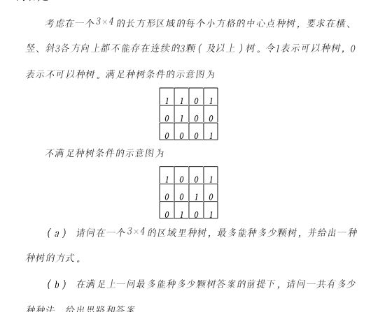

# 种树问题

## 问题描述
qq 群里见到如下问题  
  
觉得较为有趣，用 `python3` 实现了下，之后想到这个问题可以放大为 `m * n` 的土地上最多连续 `l` 棵树。

## 解决思路
问题可以分为两个核心问题：
> 1. 设计一个函数，输入一个二维数组，返回是否符合种树规则（最多连续 `l` 棵树）
> 2. 设计一个生成器，生成不重复且所有可能的二维数组

## 实现过程
见 [plant.py](./plant.py)。

## 优化点
> 1. 符合种树规则中先判断 `能否种树`还是先判断 `当前方案的种树数是否多于已有方案`  
具体可在 `plant.py` 中搜索 `# 这段代码较下一段多 50% 耗时`
> 2. 生成器中是否可以 `按种树数递减来生成种树方案` ，这样遇到的第一个可行方案就一定是最优方案  
具体可在 `plant.py` 中搜索 `# 这个函数较下一个多 300% 耗时`